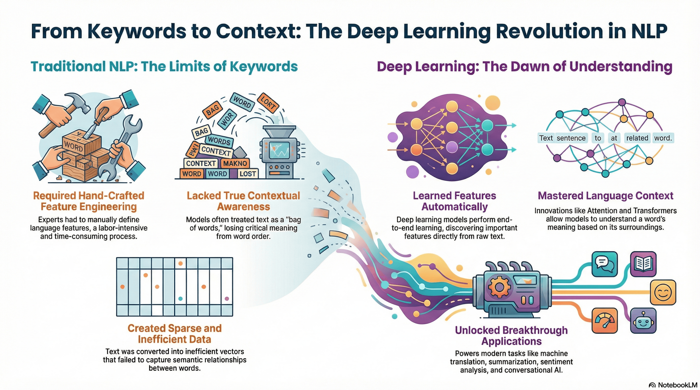

# 3.10 Natural Language Processing Advanced

## Lesson Overview

## Dependencies

Refer to the following markdown file for the respective sections of the class:

- [Self Studies](./studies.md)
- [Lesson](./lesson.md)
- [Assignment](./assignment.md)
- [Quiz](./quiz.md)
- [Reference](./reference.md)

## Lesson Objectives

* Train a **Recurrent Neural Network (RNN)** for language modeling, demonstrating an understanding of how deep learning architectures process sequential data complexities that traditional machine learning models cannot handle.

* Fine-tune a pre-trained **BERT model** to perform downstream tasks such as sentiment analysis and Named Entity Recognition (NER), utilizing the model's bidirectional attention mechanism to derive deep contextual meaning from text.

* Utilize a pre-trained GPT model for text generation, distinguishing its unidirectional transformer architecture from BERT to effectively apply it in generative applications.

## Lesson Plan

| Duration | What                    | How or Why                                               |
| -------- | ----------------------- | -------------------------------------------------------- |
| - 5mins  | Start zoom session      | So that learners can join early and start class on time. |
| 20 mins  | Activity                | Recap on self-study and prework materials.               |
| 40 mins  | Code-along              | Part 1: Deep Learning for NLP and common NLP tasks.      |
|          | **1 HR MARK**           |
| 30 mins  | Code-along              | Part 2: RNNs- LSTM and GRU.                              |
| 10 mins  | Break                   |                                                          |
| 20 mins  | Code-along              | Part 3: Attention mechanism.                             |
|          | **2 HR MARK**           |
| 50 mins  | Code-along              | Part 4: Transformers- BERT and GPT.                      |
| 10 mins  | Briefing / Q&A          | Brief on references, assignment, quiz and Q&A.           |
|          | **END CLASS 3 HR MARK** |
